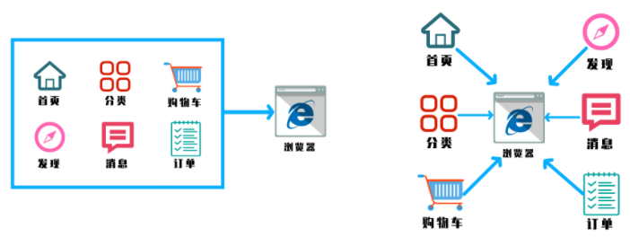

### 什么是微前端？

为了解决庞大的一整块后端服务带来的变更与扩展方面的限制，出现了微服务架构:

> 微服务是面向服务架构（SOA）的一种变体，把应用程序设计成一系列松耦合的细粒度服务，并通过轻量级的通信协议组织起来 具体地，将应用构建成一组小型服务。这些服务都能够独立部署、独立扩展，每个服务都具有稳固的模块边界，甚至允许使用不同的编程语言来编写不同服务，也可以由不同的团队来管理

前端随着越来越多的功能开发，也面临同样的问题，微前端概念产生：

> 微前端就是将不同的功能按照不同的维度拆分成多个子应用，然后通过主应用来加载这些子应用。核心概念就是拆分应用，然后再合并应用。

