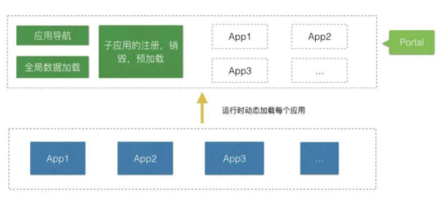

# qiankun

概念图



号称： 可能是你见过最完善的微前端解决方案

#### 特点

- 任意 js 框架均可使用。微应用接入像使用接入一个 iframe 系统一样简单，但实际不是 iframe。
- 基于 single-spa 封装，提供了更加开箱即用的 API。
- 技术栈无关，任意技术栈的应用均可 使用/接入，不论是 React/Vue/Angular/JQuery 还是其他等框架。
- 资源预加载，在浏览器空闲时间预加载未打开的微应用资源，加速微应用打开速度。
- 样式隔离，确保微应用之间样式互相不干扰。
- JS 沙箱，确保微应用之间 全局变量/事件 不冲突。
- 已在蚂蚁内外经受过足够大量的线上系统的考验及打磨，健壮性值得信赖。
- umi 插件，提供了 @umijs/plugin-qiankun 供 umi 应用一键切换成微前端架构系统。

#### 安装

```js
 yarn add qiankun  # or npm i qiankun -S
```
